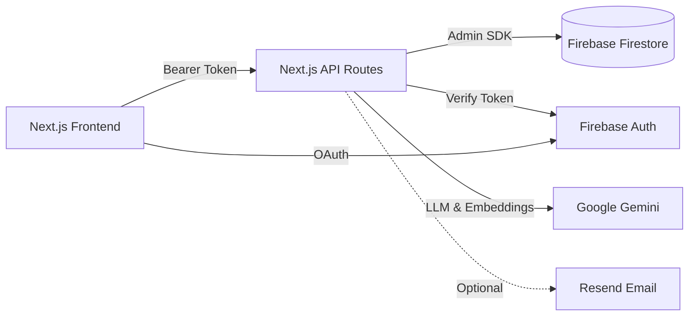

# Aspire Events


> Full-stack AI-powered event management platform with Firebase auth, smart scheduling, natural-language search, and an agentic assistant powered by Google Gemini.

---

## Features

### Core Platform
- **Firebase Auth** — Email/password, Google OAuth, and GitHub OAuth sign-in
- **Event CRUD** — Create, read, update, and delete events with Zod validation and capacity enforcement
- **RSVP System** — ATTENDING / MAYBE / DECLINED status tracking with capacity limits
- **Invitation System** — Email-based invitations with unique tokens; accept or decline via link
- **Event Search** — Keyword, date range, location, tags, RSVP status, and virtual/in-person filters
- **Email Notifications** — Invitation sent, accepted, event updated, and cancelled notifications via Resend
- **Tags & Categorization** — Denormalized tag arrays for flexible event categorization
- **Google Calendar Export** — One-click "Add to Google Calendar" URL generation
- **Role-Based Access** — Only event creators can edit/delete; private event restrictions enforced

### AI-Powered Features (Google Gemini)
- **Smart Scheduling** — AI suggests 3 optimal time slots based on attendee availability and preferences
- **Description Generator** — AI generates polished event descriptions with selectable tone (formal, casual, fun, professional)
- **NLP Search** — Natural-language event search; Gemini parses intent into structured filters
- **Conflict Detection** — Proactive scheduling conflict detection with AI-generated resolution suggestions
- **Attendee Recommendations** — AI suggests invitees based on topic similarity and attendance history
- **Post-Event Recap** — Attendance analytics, highlights, follow-up actions, and shareable text (cached in Firestore)
- **Personalized Recommendations** — Tag-frequency-based "Events For You" row tailored to each user
- **Agenda Builder** — AI generates time-blocked agendas for events of any duration
- **Attendance Prediction** — Historical similarity analysis for turnout prediction and capacity advice
- **Voice-to-Event Creator** — Web Speech API captures spoken descriptions; Gemini extracts structured event data
- **Agentic Event Assistant** — LangChain ReAct agent with 7 tools (search, schedule, conflicts, create, invite, suggest time, build agenda) and multi-turn chat UI

### Dashboard & Analytics
- **Stat Cards** — Events created, RSVP breakdown, attendance rate, upcoming count
- **Events Trend Chart** — Events created over time (Recharts)
- **RSVP Breakdown Chart** — Status distribution visualization
- **Attendance Rate Chart** — Attendance rate trend over time
- **Top Tags Chart** — Most popular event tags
- **AI Weekly Summary** — Gemini-generated summary of the week's events and activity
- **Period Selector** — 7-day, 30-day, 90-day, and all-time views

---

## Architecture



**Data flow:**
1. User authenticates via Firebase Auth (Email/Password, Google, or GitHub) → receives ID token
2. Frontend sends ID token as Bearer token to Next.js API routes
3. API routes verify the token with Firebase Admin SDK and enforce role-based access
4. API routes read/write Firestore using Admin SDK service-role credentials
5. AI features call Google Gemini (`gemini-2.5-flash`) for natural-language processing, intent extraction, and content generation
6. Email notifications dispatched through Resend when configured

---

## Tech Stack

| Layer | Technology | Version |
|---|---|---|
| Frontend | Next.js (App Router), React, TypeScript, Tailwind CSS | 14.2 / 18 / 5 / 3.4 |
| UI Components | shadcn/ui (New York style) + Radix UI primitives | — |
| Charts | Recharts | 3.7 |
| Auth & DB | Firebase Auth + Cloud Firestore | 12.9 (client) / 13.7 (admin) |
| AI / LLM | Google Gemini via `@google/generative-ai` | 0.24 |
| Agent | LangChain + LangGraph (`@langchain/google-genai`) | 1.2 / 2.1 |
| Validation | Zod + React Hook Form | 4.3 / 7.71 |
| Email | Resend (optional) | 6.9 |
| Styling | Tailwind CSS + tailwindcss-animate, class-variance-authority | 3.4 / 1.0 |
| Fonts | Geist Sans + Geist Mono (local, next/font) | — |

---

## Quick Start

### Prerequisites

- Node.js 18+ (pnpm recommended)
- A [Firebase](https://console.firebase.google.com) project with Firestore and Authentication enabled
- A [Google API key](https://aistudio.google.com/app/apikey) for Gemini

### 1. Firebase Setup

1. Create a Firebase project in the [Firebase Console](https://console.firebase.google.com)
2. Enable **Cloud Firestore** in the project
3. Enable **Authentication** with these providers:
   - Email/Password
   - Google
   - GitHub
4. Generate a **Service Account** key (Project Settings → Service Accounts → Generate New Private Key)
5. Deploy security rules from `firestore.rules` and indexes from `firestore.indexes.json`:

```bash
firebase deploy --only firestore:rules,firestore:indexes
```

### 2. Install & Run

```bash
git clone <your-repo-url>
cd "Aspire app 2"
pnpm install                          # or npm install
cp .env.example .env.local            # then fill in values below
pnpm dev                              # starts on http://localhost:3000
```

### 3. Environment Variables

| Variable | Required | Purpose |
|---|---|---|
| `NEXT_PUBLIC_FIREBASE_API_KEY` | Yes | Firebase Web SDK API key |
| `NEXT_PUBLIC_FIREBASE_AUTH_DOMAIN` | Yes | Firebase Auth domain |
| `NEXT_PUBLIC_FIREBASE_PROJECT_ID` | Yes | Firebase project ID |
| `NEXT_PUBLIC_FIREBASE_STORAGE_BUCKET` | Yes | Firebase Storage bucket |
| `NEXT_PUBLIC_FIREBASE_MESSAGING_SENDER_ID` | Yes | Firebase Cloud Messaging sender ID |
| `NEXT_PUBLIC_FIREBASE_APP_ID` | Yes | Firebase app ID |
| `FIREBASE_PROJECT_ID` | Yes | Admin SDK project ID |
| `FIREBASE_CLIENT_EMAIL` | Yes | Admin SDK service account email |
| `FIREBASE_PRIVATE_KEY` | Yes | Admin SDK private key (with `\n` line breaks) |
| `GEMINI_API_KEY` | Recommended | Google Gemini API key (required for all AI features) |
| `RESEND_API_KEY` | Optional | Resend API key for email notifications |
| `NEXT_PUBLIC_APP_URL` | Recommended | App base URL (defaults to `http://localhost:3000`) |

---

## API Reference

All endpoints require `Authorization: Bearer <firebase-id-token>` unless noted.

### Auth

| Method | Path | Purpose |
|---|---|---|
| `POST` | `/api/auth/register` | Create user account + Firestore profile |

### Events

| Method | Path | Purpose |
|---|---|---|
| `GET` | `/api/events` | List events (paginated, filtered) |
| `POST` | `/api/events` | Create new event |
| `GET` | `/api/events/[id]` | Get event detail |
| `PUT` | `/api/events/[id]` | Update event (creator only) |
| `DELETE` | `/api/events/[id]` | Delete event + cascading cleanup (creator only) |
| `POST` | `/api/events/[id]/rsvp` | Set RSVP status |
| `GET` | `/api/events/[id]/responses` | List RSVPs for event |
| `POST` | `/api/events/[id]/invite` | Send email invitations |
| `GET` | `/api/events/search` | Search events with filters |

### Invitations

| Method | Path | Purpose |
|---|---|---|
| `GET` | `/api/invitations` | List current user's invitations |
| `PUT` | `/api/invitations/[id]/respond` | Accept or decline invitation |

### Dashboard

| Method | Path | Purpose |
|---|---|---|
| `GET` | `/api/dashboard/analytics` | Dashboard analytics data (period-selectable) |

### AI Features

| Method | Path | Rate Limit | Purpose |
|---|---|---|---|
| `POST` | `/api/ai/suggest-time` | 5/min, 50/day | AI optimal time slot suggestions |
| `POST` | `/api/ai/generate-description` | 5/min, 50/day | AI event description generation |
| `GET` | `/api/ai/search` | 5/min, 50/day | NLP natural-language event search |
| `POST` | `/api/ai/check-conflicts` | 5/min, 50/day | Conflict detection + resolution suggestions |
| `POST` | `/api/ai/suggest-invitees` | 5/min, 50/day | AI attendee recommendations |
| `POST` | `/api/ai/generate-recap` | 5/min, 50/day | Post-event recap generation (cached) |
| `GET` | `/api/ai/recommendations` | 5/min, 50/day | Personalized event recommendations |
| `POST` | `/api/ai/build-agenda` | 5/min, 50/day | AI agenda builder |
| `POST` | `/api/ai/predict-attendance` | 5/min, 50/day | Attendance prediction & capacity advice |
| `POST` | `/api/ai/voice-create-event` | 5/min, 50/day | Voice-to-event creation |
| `GET` | `/api/ai/weekly-summary` | 5/min, 50/day | AI weekly activity summary |
| `POST` | `/api/ai/agent` | 3/min, 20/day | Agentic assistant (multi-turn chat) |

---

## Deployment

| Component | Recommended Provider |
|---|---|
| Hosting | Vercel |
| Auth & Database | Firebase (Auth + Cloud Firestore) |
| AI | Google Cloud (Gemini API) |
| Email | Resend |

### Production Checklist

- [ ] Set `NEXT_PUBLIC_APP_URL` to production URL
- [ ] Configure Firebase Auth redirect URLs for production domain
- [ ] Store all secrets in provider secret managers (never in repo)
- [ ] Enforce HTTPS
- [ ] Set `GEMINI_API_KEY` for AI features
- [ ] Optionally set `RESEND_API_KEY` for email notifications
- [ ] Deploy Firestore security rules and indexes (`firebase deploy --only firestore`)
- [ ] Note: in-memory rate limiter is per-instance (not shared across scaled processes)

---

## Operational Notes

| Concern | Detail |
|---|---|
| AI Model | `gemini-2.5-flash` (default for all features) |
| Rate Limits | In-memory sliding window — standard AI: 5/min, 50/day; agent: 3/min, 20/day per user; resets on server restart |
| Firestore Indexes | Composite indexes defined in `firestore.indexes.json` (events, responses, invitations) |
| Security Rules | Role-based rules in `firestore.rules` — all reads require auth, writes scoped by role |
| Email | Resend integration; notifications skipped gracefully when API key is not configured |
| Agent Tools | 7 LangChain tools: `search_events`, `get_my_schedule`, `check_conflicts`, `create_event`, `invite_people`, `suggest_meeting_time`, `build_agenda` |

---

## Repository Structure

```
├── README.md                          ← You are here
├── 1-core-features.md                 ← Milestone 1 spec
├── 2-foundation.md                    ← Milestone 2 spec
├── 3-ai-features.md                   ← Milestone 3 spec
├── 4-ai-advanced-features.md          ← Milestone 4 spec
├── AI_ADVANCED_FEATURES.md            ← Advanced AI feature spec
├── firestore.rules                    ← Firestore security rules
├── firestore.indexes.json             ← Firestore composite indexes
├── components.json                    ← shadcn/ui configuration
├── package.json
├── next.config.mjs
├── tailwind.config.ts
├── tsconfig.json
└── src/
    ├── app/
    │   ├── layout.tsx                 ← Root layout (Geist fonts, metadata)
    │   ├── page.tsx                   ← Entry redirect (→ dashboard or login)
    │   ├── globals.css                ← Tailwind + CSS variable theme
    │   ├── (auth)/                    ← Auth pages (login, register)
    │   ├── (dashboard)/               ← Protected dashboard shell
    │   │   ├── layout.tsx             ← Auth guard + Header + Assistant FAB
    │   │   ├── dashboard/page.tsx     ← Analytics dashboard
    │   │   ├── events/                ← Event list, detail, create pages
    │   │   ├── invitations/page.tsx   ← Invitation inbox
    │   │   └── settings/page.tsx      ← User settings
    │   ├── api/
    │   │   ├── auth/register/         ← User registration endpoint
    │   │   ├── events/                ← Event CRUD + search + RSVP + invite
    │   │   ├── invitations/           ← Invitation list + respond
    │   │   ├── dashboard/analytics/   ← Dashboard analytics
    │   │   └── ai/                    ← 12 AI endpoints
    │   │       ├── suggest-time/
    │   │       ├── generate-description/
    │   │       ├── search/
    │   │       ├── check-conflicts/
    │   │       ├── suggest-invitees/
    │   │       ├── generate-recap/
    │   │       ├── recommendations/
    │   │       ├── build-agenda/
    │   │       ├── predict-attendance/
    │   │       ├── voice-create-event/
    │   │       ├── weekly-summary/
    │   │       └── agent/
    │   └── invitations/respond/       ← Token-based invitation response page
    ├── components/
    │   ├── ai/                        ← 11 AI feature components
    │   │   ├── SmartScheduler.tsx
    │   │   ├── DescriptionGenerator.tsx
    │   │   ├── NlpSearchBar.tsx
    │   │   ├── ConflictAlert.tsx
    │   │   ├── InviteeSuggestions.tsx
    │   │   ├── AgendaBuilder.tsx
    │   │   ├── EventRecapGenerator.tsx
    │   │   ├── EventRecommendations.tsx
    │   │   ├── AttendancePrediction.tsx
    │   │   ├── VoiceEventCreator.tsx
    │   │   └── EventAssistant.tsx
    │   ├── dashboard/                 ← 6 analytics/chart components
    │   ├── events/                    ← Event UI components
    │   ├── layout/
    │   │   └── Header.tsx             ← App header/navigation
    │   └── ui/                        ← 17 shadcn/ui primitives
    ├── context/
    │   └── AuthContext.tsx             ← Firebase Auth provider + hooks
    ├── hooks/
    │   ├── useAI.ts                   ← Generic AI endpoint hook
    │   └── use-toast.ts               ← Toast notification hook
    ├── lib/
    │   ├── firebase.ts                ← Firebase client SDK init
    │   ├── firebase-admin.ts          ← Firebase Admin SDK singleton
    │   ├── auth.ts                    ← Server-side token verification
    │   ├── gemini.ts                  ← Google Gemini client init
    │   ├── ai-helpers.ts              ← AI utilities (callGemini, rate limiting)
    │   ├── agent.ts                   ← LangChain ReAct agent setup
    │   ├── agent-tools.ts             ← 7 LangChain agent tools
    │   ├── api-client.ts              ← Frontend API client (auto Bearer token)
    │   ├── validators.ts              ← Zod schemas
    │   └── utils.ts                   ← General utilities (cn, etc.)
    ├── types/
    │   └── firestore.ts               ← TypeScript types for Firestore documents
    └── utils/
        ├── dates.ts                   ← Date formatting & comparison helpers
        └── google-calendar.ts         ← Google Calendar URL generator
```
